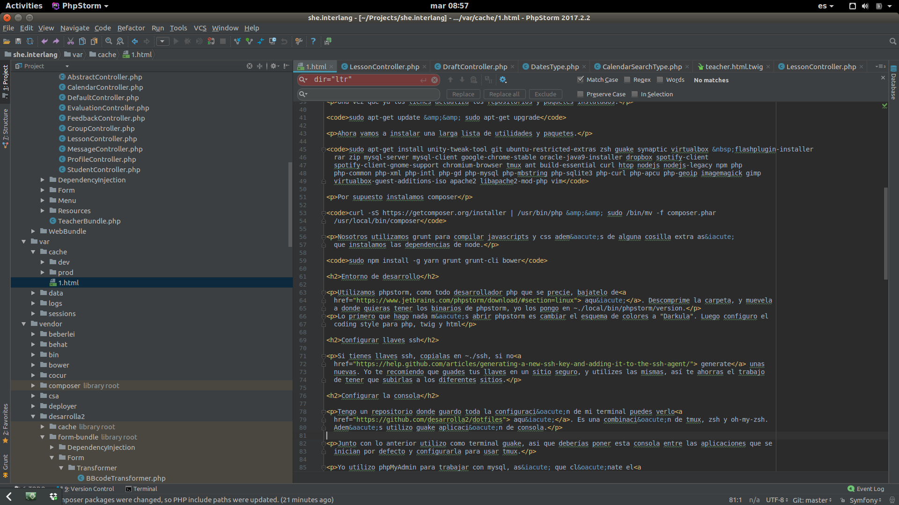
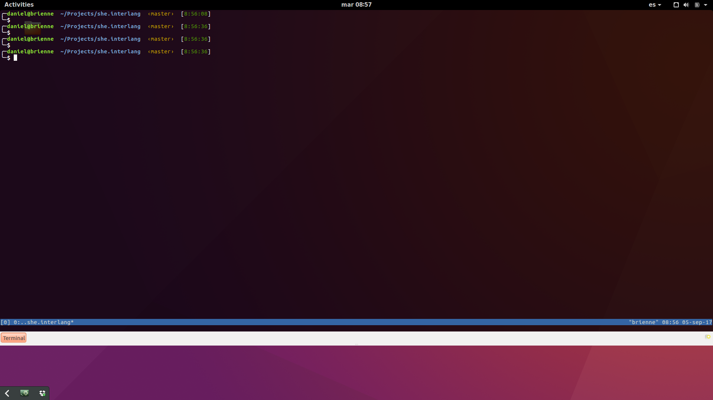
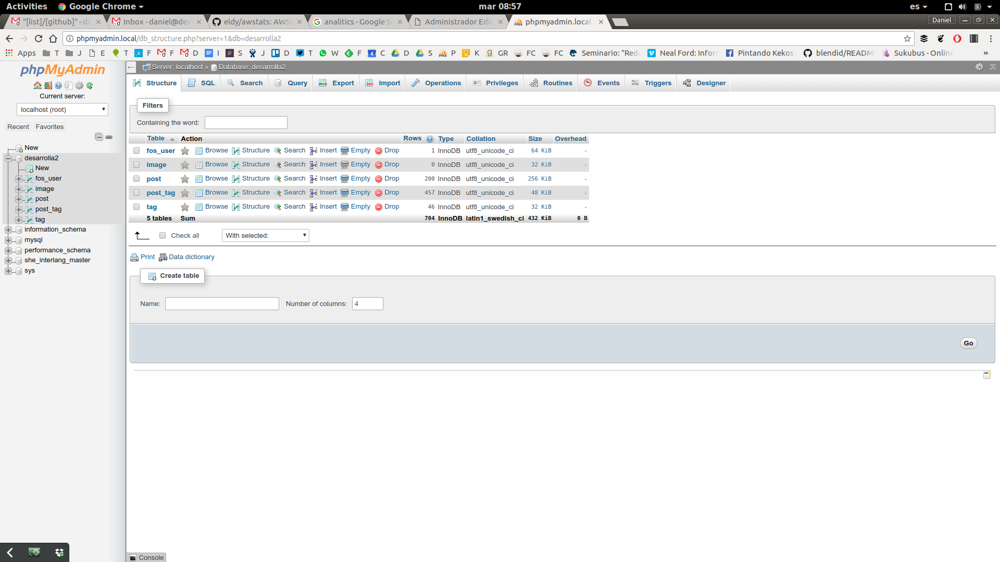

A continuación algunas notas de cómo instalamos nuestro entorno de trabajo en[ devtia.com.](https://devtia.com)

Tratamos de utilizar un stack tecnológico que cumpla los siguientes requisitos.

- Tan actualizado cómo sea posible, sin sacrificar estabilidad.
- Tan estándar como sea posible, salvo que salirnos del estándar nos ofrezca un salto cuantitativo importante.

## Sistema operativo

Nosotros trabajamos con ubuntu. Utilizamos la última LTS disponible en este caso la 16.04. Como entorno de escritorio utilizamos gnome shell.

Lo ideal es que tanto los entornos de desarrollo como los servidores utilizen el mismo sistema operativo y la misma versión. Te vas a ahorrar algunos problemas con versiones de paquetes en el futuro.

## Repositorios y paquetes

Pongamos manos a la obra, no voy a ir dando muchos detalles sobre cada uno de los pasos

Lo primero es ir añadiendo los repositorios no oficiales de dropbox, java, spotify y chrome

`sudo add-apt-repository ppa:webupd8team/java`

`wget -q -O - https://dl-ssl.google.com/linux/linux_signing_key.pub | sudo apt-key add -  sudo sh -c 'echo "deb [arch=amd64] http://dl.google.com/linux/chrome/deb/ stable main" >> /etc/apt/sources.list.d/google.list'`

`sudo apt-key adv --keyserver pgp.mit.edu --recv-keys 5044912E && sudo sh -c 'echo "deb http://linux.dropbox.com/ubuntu/ xenial main" >> /etc/apt/sources.list.d/dropbox.list'`

`sudo apt-key adv --keyserver keyserver.ubuntu.com --recv-keys D2C19886 && sudo sh -c 'echo "deb http://repository.spotify.com stable non-free" >> /etc/apt/sources.list.d/spotify.list'`

`sudo apt-add-repository ppa:ansible/ansible`

Una vez que ya los tienes actualiza los repositorios y paquetes instalados.

`sudo apt-get update && sudo apt-get upgrade`

Ahora vamos a instalar una larga lista de utilidades y paquetes.

`sudo apt-get install unity-tweak-tool git ubuntu-restricted-extras zsh guake synaptic virtualbox  flashplugin-installer rar zip mysql-server mysql-client google-chrome-stable oracle-java9-installer dropbox spotify-client spotify-client-gnome-support chromium-browser tmux ant build-essential curl htop nodejs nodejs-legacy npm php php-common php-xml php-intl php-gd php-mysql php-mbstring php-sqlite3 php-curl php-apcu php-geoip php-xdebug imagemagick gimp virtualbox-guest-additions-iso apache2 libapache2-mod-php vim annsible`

Por supuesto instalamos composer

`curl -sS https://getcomposer.org/installer | /usr/bin/php && sudo /bin/mv -f composer.phar /usr/local/bin/composer`

Nosotros utilizamos grunt para compilar javascripts y css además de alguna cosilla extra así que instalamos las dependencias de node.

`sudo npm install -g yarn grunt grunt-cli bower`

## Entorno de desarrollo

Utilizamos phpstorm, como todo desarrollador php que se precie, bajatelo de[ aquí](https://www.jetbrains.com/phpstorm/download/#section=linux). Descomprime la carpeta, y muevela a donde quieras tener los binarios de phpstorm, yo los pongo en ~./local/bin/phpstorm/version.

Lo primero que hago nada más abrir phpstorm es cambiar el esquema de colores a "Darkula". Luego configuro el coding style para php, twig y html.



phpstorm

## Configurar llaves ssh

Si tienes llaves ssh, copialas en ~./ssh, si no[ generate](https://help.github.com/articles/generating-a-new-ssh-key-and-adding-it-to-the-ssh-agent/) unas nuevas. Yo te recomiendo que guades tus llaves en un sitio seguro, y utilizes las mismas, así te ahorras el trabajo de tener que subirlas a los diferentes sitios.

## Configurar la consola

Tengo un repositorio donde guardo toda la configuración de mi terminal puedes verlo[ aquí](https://github.com/desarrolla2/dotfiles). Es una combinación de tmux, zsh y oh-my-zsh. Además utilizo guake aplicación de consola.

Junto con lo anterior utilizo como terminal guake, asi que deberías poner esta consola entre las aplicaciones que se inician por defecto y configurarla para usar tmux.



Guake

## phpMyadmin

Yo utilizo phpMyAdmin para trabajar con mysql, así que clónate el[ repositorio](https://github.com/phpmyadmin/phpmyadmin). Es fácil configurar PhpMyAdmin para trabajar con varios sistemas de bases de datos, a continuación te pongo un ejemplo de config.inc.php

```
`<?php
$cfg['blowfish_secret'] = '22eeff657797d5167430ae635777bd2c';


$servers = [
    'localhost' => [
        'host' => '127.0.0.1',
        'user' => 'root',
        'pass' => 'password',
    ],
    'devtia1 (ssh)' => [
        'host' => '127.0.0.1',
        'user' => 'root',
        'pass' => 'password',
        'port' => '3307',
    ],
];

$i = 0;

foreach ($servers as $name => $config) {
    $i++;
    $cfg['Servers'][$i]['verbose'] = $name;
    $cfg['Servers'][$i]['host'] = $config['host'];
    $cfg['Servers'][$i]['user'] = $config['user'];
    $cfg['Servers'][$i]['password'] = $config['pass'];
    if (isset($config['port'])) {
        $cfg['Servers'][$i]['port'] = $config['port'];
    }
    $cfg['Servers'][$i]['auth_type'] = 'config';
    $cfg['Servers'][$i]['connect_type'] = 'tcp';
    $cfg['Servers'][$i]['compress'] = true;

    $cfg['Servers'][$i]['pmadb'] = 'phpmyadmin';
    $cfg['Servers'][$i]['bookmarktable'] = 'pma_bookmark';
    $cfg['Servers'][$i]['relation'] = 'pma_relation';
    $cfg['Servers'][$i]['table_info'] = 'pma_table_info';
    $cfg['Servers'][$i]['table_coords'] = 'pma_table_coords';
    $cfg['Servers'][$i]['pdf_pages'] = 'pma_pdf_pages';
    $cfg['Servers'][$i]['column_info'] = 'pma_column_info';
    $cfg['Servers'][$i]['history'] = 'pma_history';
}

/**
 * End of servers configuration
 */

/**
 * Directories for saving/loading files from server
 */
$cfg['UploadDir'] = '';
$cfg['SaveDir'] = '';
  `
```

En[ esta](https://desarrolla2.com/post/conectarse-a-mysql-a-traves-de-un-tunel-ssh) otra entrada puedes ver como utilizamos túneles ssh para conectarnos con bases de datos remotas.



phpmyadmin

## Servidor web

En local utilizo apache2 como servidor web. Actualmente puedes usar php como servidor web para el entorno de desarrollo, pero creo que es mejor trabajar un poco más, pero tener un entorno más configurable y parecido a producción. En producción utilizamos nginx en lugar de apache, realmente no creo que ninguno de los dos ofrezca una ventaja muy grande sobre el otro, lo hacemos así porque tenemos una configuración muy trabajada para nginx para entornos de producción.

Aquí un ejemplo de un virtual host para desarrollo, genera un fichero como este en el directorio /etc/apache2/sites-available. Tiene que tener la extensión .conf, por ejemplo desarrolla2.local.conf

```
`
    <VirtualHost *:80>
    ServerName desarrolla2.local
    DocumentRoot /home/daniel/Projects/devtia.core/web
    <Directory /home/daniel/Projects/devtia.core/web/>
        Options Indexes FollowSymLinks MultiViews
        AllowOverride None
        Require all granted
        <IfModule mod_rewrite.c>
            RewriteEngine On
            RewriteCond %{REQUEST_FILENAME} !-f
            RewriteRule ^(.*)$ /app_dev.php [QSA,L]
        </IfModule>
        <IfModule mod_headers.c>
            Header set Cache-Control "private, no-cache, no-store, proxy-revalidate, no-transform"
            Header set Pragma "no-cache"
        </IfModule>
      </Directory>
</VirtualHost>
  `
```

Habilita el sitio, los módulos de apache y reinicia.

`sudo a2ensite desarrolla2.local.conf && sudo a2enmode rewrite headers && sudo service apache2 restart`

Como ves utilizamos nombres de dominio del tipo .local para entornos de desarrollo, necesitas indicar a tu navegador que este host se encuentra en localhost por lo que necesitas añadir esta linea "127.0.0.1 desarrolla2.local" al final de tu fichero /etc/hosts.
