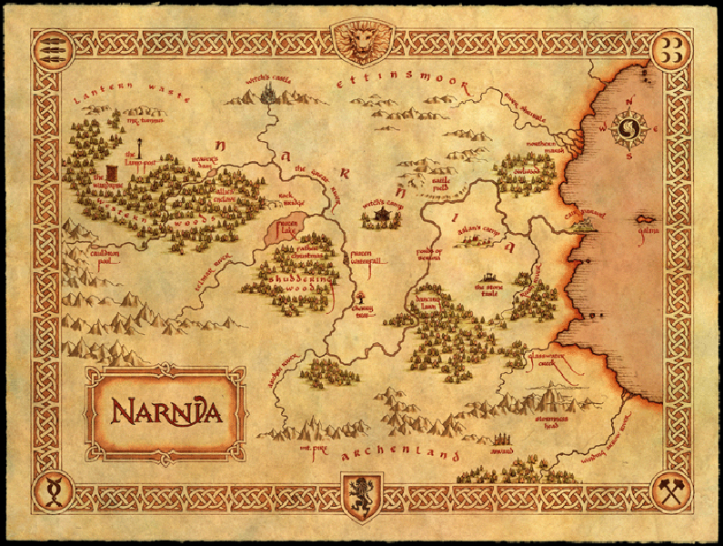
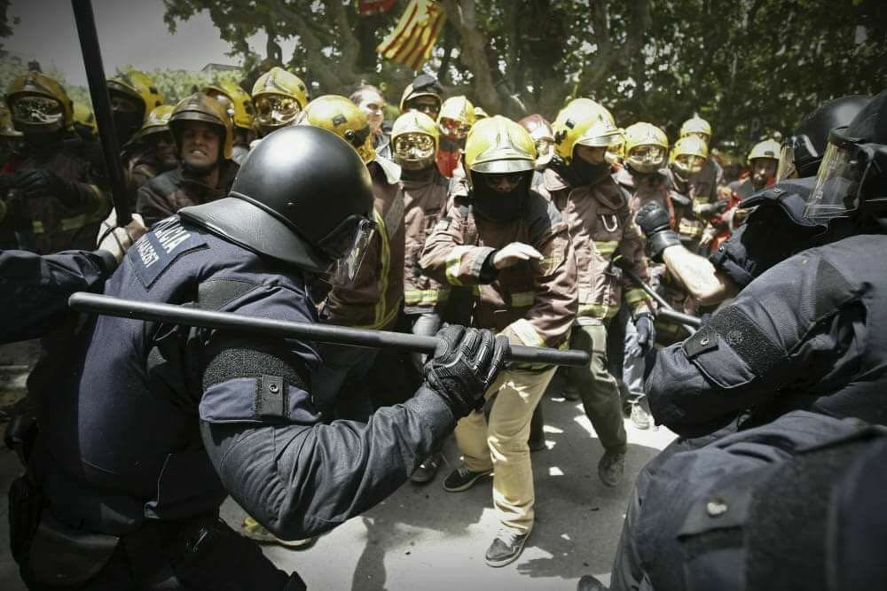

**No me gusta mojarme en temas políticos**, y menos públicamente. Es como nadar contra
  corriente. Cada uno tiene su punto de vista, y no está dispuesto a cambiarlo por lo que suelo evitar estas
  confrontaciones.

No me considero un patriota, más bien una persona pragmática. Los nacionalismos en lo que a mí
  respecta son cosas de otro siglo.

Trataré en esta entrada de dar mi visión sobre el asunto catalán.

## Tendencia internacional

Aunque existen movimientos independentistas en diferentes países, la tendencia internacional es a crear
  coaliciones cada vez más grandes, con políticas internacionales comunes.

En lo que a mí respecta tiene más sentido el [iberismo](https://es.wikipedia.org/wiki/Iberismo) que el independentismo.

## Reclamación histórica

Cataluña tiene históricamente una identidad propia, un idioma, una cultura y costumbres propias. Sin
  embargo lo que nos une es mucho más que lo que nos diferencia.

Narnia, el país que al igual que la republica catalana es mentira

Lo cierto es que cataluña tal y cómo la conocemos hoy nunca ha sido un estado independiente.

## El motivo ecónomico

Puedes investigar que ocurrió a nivel económico en los diferentes procesos de independencia en el mundo
  durante el siglo XX. Como la independencia de [Checoslovaquia](https://es.wikipedia.org/wiki/Disoluci%C3%B3n_de_Checoslovaquia#Econom.C3.ADa), [Yugoslavia](https://es.wikipedia.org/wiki/Disoluci%C3%B3n_de_Yugoslavia#Colapso_econ.C3.B3mico_y_clima_internacional),
  o la desintegración de la [URSS](https://es.wikipedia.org/wiki/Disoluci%C3%B3n_de_la_Uni%C3%B3n_Sovi%C3%A9tica#Colapso_econ.C3.B3mico_de_la_URSS).

Los casos más similares que he podido encontrar son los movimientos independentistas de [Quebec](http://www.eleconomista.es/economia/noticias/7029497/09/15/El-proceso-separatista-en-Quebec-hundio-la-economia-de-la-zona.html)
  y el caso de Irlanda, en ambos casos con consecuencias económicas.

Muchas empresas ya [han trasladado
  su sede fuera de Cataluña](https://elpais.com/economia/2017/10/09/actualidad/1507570625_950581.html) y otras se plantean hacerlo. A priori, esto no tieneningún tipo de efecto,
  ya que no están moviendo sus centros de trabajo o de producción, pero sí que es una declaración
  de intenciones con respecto a de qué lado prefieren quedarse, y no es otro que dentro de España y de
  Europa.

¿Estás realmente dispuesto a perder tu trabajo o el de familiares y amigos, por vivir en un estado
  independiente de España? ¿Serás maś feliz así?

## La represión del Estado español

El día 1 de Octubre tuvo lugar la convocatoria de un “referéndum” ilegal. El estado tiene
  el derecho legítimo a utilizar la violencia para hacer cumplir la ley, y sobre todo para mantener la integridad
  de su territorio.

Los grupos independentistas quieren vender esto como una “masacre” de la guardia civil y la policía
  en la que los mossos no quisieron participar, porque no quisieron ir contra su pueblo.

Te recomiendo ver el video de la entrevista de Jordi Évole al jefe a un comisario de los mossos, o los
  diferentes videos del desalojo a la plaza Cataluña el 27M.

Si crees que la policía española actuó de forma salvaje, busca cualquier video de actuaciones de
  antidisturbios de cualquier país, verás cosas mucho más salvajes.

Entonces tenemos a unos dirigentes políticos, que convocan un referéndum ilegal, y que lanzan a su
  "pueblo" a los leones. El verdadero objetivo era buscar una foto que avalara el movimiento. Si pudiera ser
  con muertos mejor que mejor.

Y si no se consigue se inventa. Han corrido por las redes diferentes bulos con respecto a lo ocurrido aquel día,
  la señora que le rompieron los dedos, fotos que corresponden a otras manifestaciones, etc.

En un grupo de whatsapp, un excompañero catalán me envió la siguiente foto.

Carga de los mossos 2013

Creo que pretendía mostrarse como los bomberos salieron a la calle, para impedir la masacre, pero esta foto se
  corresponde a una [ carga
    de los mossos contra bomberos en 2013](http://www.abc.es/local-cataluna/20130314/abci-bomberos-manguerazos-mossos-esquadra-201303141751.html).

[Aqui](http://www.elmundo.es/f5/comparte/2017/10/02/59d20455268e3e96278b45de.html) tienes una lista
  completa de bulos sobre lo ocurrido el 1 de Octubre.

¿Estoy de acuerdo con la brutalidad policial? Por supuesto que NO. Pero no creo que lo visto en Cataluña
  se salga mucho de lo normal.

## Validez del referendum

Los [resultados](http://www.elperiodico.com/es/politica/20171006/resultados-referendum-cataluna-2017-6319340) del
  referendum fueron anunciados por el gobierno de la generalidad. Una abrumadora mayoría del si, pero nadie puede
  negar que dicho referendum fue controlado por una parte interesada en el resultado.

Piensa un poco. ¿Crees que en algún lugar del mundo hay un consenso de más del 90% de la población
  en algo? Quizá en una dictadura.

La ley del referendum, se aprobó con 72 diputados. En [esta
  entrevista](https://www.youtube.com/watch?v=JZHZRYy0VSg) Jordi Evole le pregunta a Puigdemont que por que si para aprobar una ley de mucho menor importancia es
  necesario una mayoría cualificada, es decir 90 diputados, ¿Como considera legitimo aprobar la ley del
  referendum le vale con 72? Puigdemont contesta: *"No hay otra forma"*. Si que la hay. Conseguir
  apoyos, en eso consiste la democracia.

De hecho en el 2015 se realizarón unas [elecciones anticipadas](https://es.wikipedia.org/wiki/Elecciones_al_Parlamento_de_Catalu%C3%B1a_de_2015) que
  fueron planteadas como plebiscitarias por el independentismo. Unas elecciones en las que no obtuvieron el 50% de los
  votos que les daría autoridad moral. ¿Aceptaron el resultado? No.

## La republica catalana

Alguien puede responder a preguntas tan importantes como: ¿Cómo se van a pagar las pensiones? ¿Como
  se va a repartir la deuda del estado español de la que Cataluña ha sido parte hasta ahora? ¿Que
  va a pasar con las infraestructuras que pertenecen al estado español? ¿Como va a defenderse la
  republica? ¿Como van a ser las relaciones de este nuevo estado con sus vecinos? ¿Como van a
  financiarse?

Quizá estas preguntas deberían ser contestadas antes de seguir adelante, lo que viene siendo mirar si
  la piscina tiene agua antes de saltar.

España es un país corrupto, si, pero no menos que [Cataluña](https://es.wikipedia.org/wiki/Categor%C3%ADa:Corrupci%C3%B3n_en_Catalu%C3%B1a), a menos que
  el plan sea dejar a todos vuestros políticos fuera justo antes de proclamar la republica, no es un argumento
  razonable.

## No hay otro camino

Mentira. Si **hay otro camino** se puede [reformar la constitución](http://cadenaser.com/ser/2016/12/05/politica/1480978043_514704.html). Y no
  está fuera de su alcance. Podemos, y el PSOE estarían en la mesa de diálogo, otros partidos
  nacionalistas también. Una parte de la población Española vería con buenos ojos un
  referendum legal en Cataluña. Muchos estamos bastante cansados de tanta reclamación de independencia.
  ¿Quieres irte? Vamos a hacer un referendum con garantías.

¿Por qué no lo hacen? Si llevas 300 años esperando, por que no esperar un poco más. Pues
  porque por una vía pacífica no van a conseguir ganar un referéndum ni de coña. Es ahora o
  nunca, dentro de un par de años, la gente ya estará hasta los huevos de la autodeterminación, de
  ir a manifestaciones, y volverá a preocuparse de lo que realmente importa.

Atención al [plan](https://politica.elpais.com/politica/2017/10/09/actualidad/1507569660_552707.html) que tiene la
  generalidad. ¿Da miedo no? No me gustaría estar en un país en el que mis gobernantes piensen que
  **para hacer una tortilla hay que romper los huevos**.

## Puigdemont traidor y cobarde

Ayer tenía que haber declarado la independencia. La declaró y la suspendió. ¿Por que? [Por que no es viable ahora
  mismo para cataluña ser un estado independiente](https://politica.elpais.com/politica/2017/10/06/actualidad/1507304009_360070.html). Es todo una mentira. [No hay apoyo
  internacional](https://politica.elpais.com/politica/2017/10/10/actualidad/1507622796_620047.html). Parte un país por la mitad, siembre el odio entre la gente que vivimos aquí, genera
  un problema económico y social, como hace mucho tiempo que no se veía, y todo para qué, para algo
  que [no es posible](https://politica.elpais.com/politica/2017/10/06/actualidad/1507304009_360070.html).

Declaración de independencia y suspensión de la misma en unos segundos

## Cada país tiene el gobierno que se merece

Estoy a favor del referendum en Cataluña. De forma legal y con las reglas del juego claras. Que la gente sepa
  a lo que se enfrenta. Y por supuesto, que ambos bandos acepten el resultado.

Si los Catalanes quieren eso aunque sea una mala decisión, pues que le vamos a hacer.

Además tengo la teoría que trás unos años de un hipotético independentismo,
  aparecerían fuertes movimientos unionistas, y se votaría para volver a ser parte de España.
