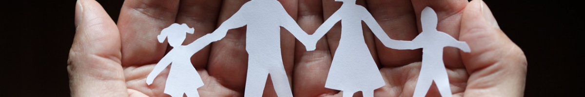

Escribir los objetivos del año es algo que llevo haciendo un par de años. Ayuda a mantenerse enfocado a lo largo del mismo. Este año me he decidido a escribirlos públicamente.

## Personales

A veces me he llegado a obsesionar con el trabajo, y me he llegado a olvidar que lo primero es lo primero. Por eso siempre pongo los objetivos personales lo primero de la lista.

1. **Ser buen padre y marido**. Hace cerca de dos años, que me casé y un poco más de un año que fui padre.
2. **Perder peso**. Este es el objetivo que fallo cada año. Actualmente peso unos 114 kilos con 182 centímetros de altura. Me gustaría acabar 2018 en una cifra cercana a los 100.
3. **Leer 12 libros.**

## Profesionales

2017 ha sido un año ENORME a nivel profesional. Devtia a facuturado ( y cobrado ) bastante, he aprendido un montón y sobre todo, estoy aprendiendo cuales son mis también enormes limitaciones en algunos aspectos que consideraba sencillos.

1. **Mantener la empresa a flote**.
2. **Lanzar productos propios o al menos participados**. Tenemos algunas ideas en la cabeza con las que nos gustaría empezar jugar. Iré contando por aqui la evolución de algunas de ellas.

Esto es todo, ¿te parece poco? Lo cierto es que yo me daría con un canto en los dientes si se cumplen estos 5 objetivos.
