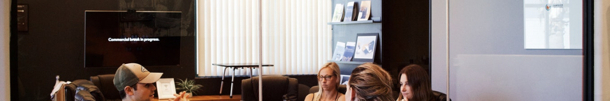
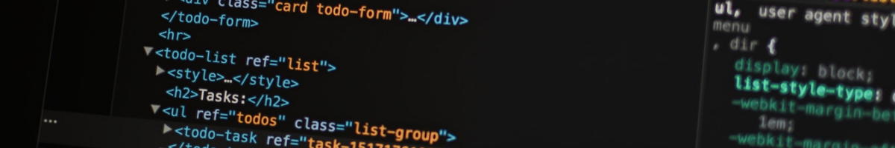

El objetivo del proceso de selección obviamente es encontrar al candidato correcto, generando la menor cantidad de esfuerzo tanto para el candidato como para nosotros.

Algunas empresas consideran que el candidato correcto es aquél que cumple con los requisitos necesarios, y cuyas expectativas económicas son lo más bajo posible.

Nosotros damos una pequeña vuelta a este concepto, considerando que la coincidencia tiene que ir en los dos sentidos, esto es: que el candidato cumpla con los requisitos de la empresa, pero a su vez entender que tipo de trabajo sería el ideal para el candidato y que este se parezca lo máximo posible a lo que ofrecemos nosotros como compañía. De esta forma te aseguras una relación laboral a más largo plazo.

Una vez presentados los objetivos del proceso de selección vamos a dar forma a las diferentes fases.

## Preselección

Normalmente recibimos las candidaturas por dos canales o bien por que hemos publicado una oferta en un portal de empleo, o bien nos contactan directamente por que han visto la oferta en este blog o en alguna red social.

Lo primero que hacemos es abandonar el portal de empleo y seguir el proceso a través de un pequeño crm que hemos desarrollado para este propósito. El motivo es no tener que depender de la plataforma de un tercero para procesos de selección presentes o futuros.

Damos de alta una ficha de candidato, donde completamos información de contacto básica y comenzamos a revisar que cumples los requisitos más básicos. A veces hay candidatos que podrían ser descartados en este mismo momento, pero que una buena carta de presentación, te hacen conectar con él, y aunque no los cumpla, decides mantener su candidatura.

En este paso pueden ser descartados entre un 70% y un 80% de los candidatos, y los motivos más habituales es que no viven en Madrid, o que no tienen la experiencia suficiente.

Los candidatos que son descartados en este momento no son notificados. ¿por qué? simplemente por que son candidaturas que no cumplen las condiciones solicitadas en la oferta, y si no te has molestado en leer detenidamente la oferta, no nos sentimos moralmente obligados a contestarte. Si en una semana no nos hemos puesto en contacto contigo, lo más probable es que hayas sido descartado.

## Llamada telefónica

Nos ponemos en contacto con el candidato telefónicamente o acordamos con él una hora para una llamada telefónica. Suele ser una llamada breve de unos 15 o 20 minutos.

Esta fase tiene dos objetivos:

1. **Explicar los detalles de la oferta**, así como responder a las posibles cuestiones que plantee el candidato.
2. **Completar** si hiciera falta, **la ficha de candidato** con detalles específicos.

Algunos candidatos se han extrañado por que hacemos pocas preguntas en la entrevista telefónica, el motivo es que preferimos dejar la batería fuerte de preguntas para la entrevista personal.

En esta fase descartamos muy pocos candidatos, y se les notifica en el mismo momento. Un caso típico de descarte en esta fase son las expectativas económicas. Por ejemplo si buscamos a alguien con dos años de experiencia en symfony y tu has "hecho algo hace tiempo" y nos pides 40K, yo no digo que no los valgas, digo que no puedo pagarte 40K para tener que enseñarte.

## Entrevista personal

La entrevista personal es el plato fuerte del proceso de selección. En nuestro caso la entrevista personal la hacemos habitualmente todo el equipo.

Tiene dos partes:

En la primera parte nos enfocamos en entender **qué tipo de candidato eres**, **cuales son tus motivaciones**, **que trabajo te gustaría tener** y este tipo de cosas.

El objetivo de esta parte es encontrar esa **coincidencia entre lo que buscas y lo que ofrecemos**. Por así decirlo en esta fase no me importa si has sido core contributor de symfony, si no si tus expectativas de un trabajo ideal se parecen a lo que hacemos en nuestro dia a día.

En la segunda parte** nos gusta enseñar qué es lo que hacemos**. Valoramos el tipo de preguntas que nos hace un candidato, por ejemplo si nos pregunta, ¿cómo gestionáis las tareas?, le enseñamos el board del proyecto en jira, y le contamos cómo nos gestionamos en el día a día y por qué. Si nos pregunta ¿Cúal es vuestra política de test? pues lanzamos los test en ese momento y le enseñamos algunos ejemplos.

Esta es la parte más abierta del proceso ya que cada candidato puede preguntar cosas muy diferentes.

Tratamos de ser muy transparentes, de nada nos sirve que vengas a trabajar con nosotros y a los seis meses presentes tu renuncia, por que este no es el trabajo que esperabas.

En esta fase se suelen descartar aproximadamente el 50% de los candidatos que llegan a la misma. Los motivos aquí pueden ser muy diversos, desde que nos de la sensación de que has tratado de mentirnos durante la entrevista, o que tus objetivos a medio largo plazo no sean los que puede ofrecerte esta empresa.

## Prueba técnica

Es una prueba muy sencilla, si tienes los conocimientos adecuados, no vas a tener ningún problema en superarla. Es tan sencilla que la vas a poder superar aunque no los tengas, si pones el suficiente empeño.

El objetivo de la prueba es valorar si tienes los conocimientos técnicos que dices tener. 

Es una prueba muy abierta, se puede resolver de muchas formas diferentes, y la forma en la que lo resuelvas nos dirá mucho de qué tipo de programador eres.

Algunos candidatos nos han indicado que preferirían preguntas técnicas durante la entrevista personal, pero aquí sómos más de leer código ;).

En esta fase no se suele descartar a casi nadie. Evaluamos el test en base a lo que nos has contado hasta ahora. Por ejemplo dijiste que eras "un amante de los test" pero la prueba tiene test mal planteados, o nos dijiste que tenías mucha experiencia con symfony, y luego vemos carencias de conocimientos básicos cómo el uso de formularios, servicios, doctrine.

## Concilio de Elrond

El proceso está pensado para que llegen hasta el final un reducido grupo de candidatos. Digamos que todos los que han llegado hasta aquí serían buenos candidatos, pero ahora tenemos que ponderar la candidatura en conjunto:

1. Feeling personal / soft skills.
2. Objetivos a medio largo plazo.
3. Conocimientos técnicos que eran requisitos en la oferta.
4. Conocimientos técnicos que aporta el candidato, que puedan aportar a la compañía, pero que no eran requisitos en la oferta. 
5. Expectativas salariales.

Hacemos un último team meeting donde hacemos una valoración completa de estos candidatos, y los ordenamos de mayor a menor por orden de preferencia. Nos quedamos con dos o tres y e informamos a todos los demás de que **no han sido seleccionados**.

## Oferta al candidato

Nos ponemos en contacto telefónico con el candidato seleccionado recordandole las condiciones finales y resolviendo cualquier duda si es que la hubise. También se las enviamos por escrito a modo de "pre contrato" para que las tenga por escrito y no existan mal entendidos. Le damos al candidato un periodo razonable para tomar una decisión, es posible que el candidato no acepte la oferta, pero normalmente los que llegan al final, es por que el "mach" es muy bueno entre las dos partes.

Una vez que el candidato nos confirma que acepta la oferta comienza un proceso en el que vamos requiriendo los datos típicos y que nos servirán para tenerlo todo listo el día en que comienza a trabajar con nosotros.

Si el candidato rechazara la oferta, haríamos una oferta al siguiente candidato.

## ¿Y los no seleccionados?

Los que superan la entrevista personal y la prueba técnica no son candidatos descartados. Simplemente **son candidatos no seleccionados**. Por esto que se comunica a cada uno personalmente que ha sido no seleccionado y se les explica brevemente el motivo.

No entramos en debates con los candidatos, si no que les ofrecemos un **feedback sincero** sobre lo que nosotros hemos visto, por ejemplo si hemos considerado que no eres un jugador de equipo, no quiere decir que realmente no lo seas, pero nuestro feedback te puede ayudar a mostrar mejor esa habilidad en futuros procesos de selección ya sea con nosotros o con otra compañía.

¿Que opinas de nuestro proceso de selección? ¿Que cambiarías? ¿Cuales son sus puntos debíles?

Déjanoslo en la caja de comentarios
