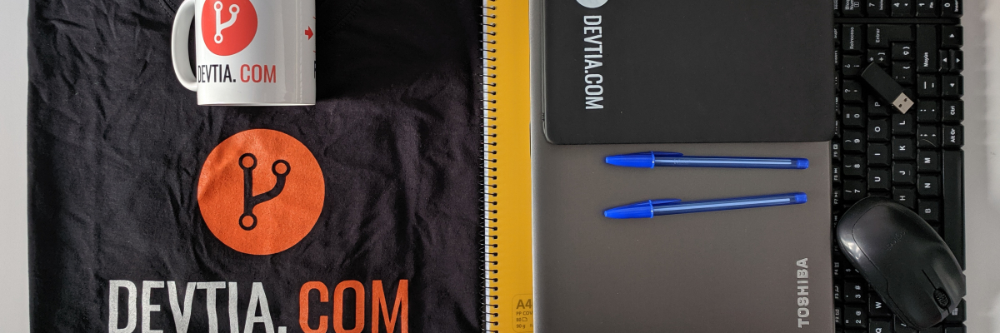

En esta entrada vamos a detallar como es nuestro proceso de onboarding. Vamos a publicar esta entrada con dos objetivos principales.

1. Dejar documentado el proceso, así cada vez que añadimos un compañero al equipo, poder revisar esta entrada y que no se nos olvide nada.
2. Ser tan transparentes como sea posible con los futuros candidatos.

El proceso de onboarding es **algo muy importante**. He visto muchos sitios donde llegas el primer día y todavía no se sabe dónde te vas a sentar, tu equipo todavía no ha sido solicitado, etc. No voy a decir el nombre pero en una empresa en la que trabajé me tocó estar con mi equipo personal durante seis meses, por que nadie se tomaba la molestia de comprarme uno.

Por eso queremos diferenciarnos, por entre otras cosas, **tratar con profesionalidad al recién llegado**.

## Acepta la oferta

Cuando hacemos una oferta, en el correo **incluimos los detalles fundamentales de la oferta**. Este paso es importantísimo, ya que a veces el proceso de selección dura unas cuantas semanas, y tanto el candidato como el entrevistador pueden cometer errores o cambiar de opinión. Me refiero a detalles como el tipo de contrato, salario, días de vacaciones, horarios, tiempo de prueba y todo este tipo de cosas.

Si el candidato acepta, le enviamos un nuevo correo donde le solicitamos los datos necesarios para su alta en la seguridad social, la redacción del contrato y algunos datos extra que solicitamos.

## Las dos semanas previas a la incorporación

Estas dos semanas son el momento adecuado para preparar en conciencia la llegada de este nuevo compañero.

Estas son las tareas que debemos completar:

1. Decidir cuál será su puesto de trabajo, asegurarnos que la silla es adecuada y que su puesto tiene sentido con respecto a la gente con la que necesita trabajar.
2. Creamos usuarios para las herramientas de trabajo y le enviamos un correo resumen con los detalles de acceso de cada una: Correo, Jira, Bitbucket, Slack, Jenkins ... etc
3. Formateamos su equipo.
	
1. Todos nuestros equipos son [toshiba portege](http://www.toshiba.es/laptops/product-filter/?sFamily=portege). Un ultrabook de poco más de un kilo de peso, con muy buenos acabados. Compramos siempre disco duro SSD y 16GB de RAM. 
2. A menos que hayamos pactado lo contrario, trabajamos todos con el mismo sistema operativo, normalmente la última LTS de ubuntu disponible.
		
1. Realizamos una "pre instalación" del entorno, y de la configuración de seguridad.
2. Redactamos un correo indicando los puntos básicos del proyecto en el que va a comenzar a trabajar, urls, repositorios, etc.
3. Seleccionamos algunas tareas de entrada, y se las dejamos asignadas.
4. Preparamos el pack de bienvenida.
	
1. Portatil, funda, pantalla, ratón y teclado inalámbricos
2. Camiseta y taza corporativas.
3. Un par de cuadernos y bolis.
4. Su contrato de trabajo.

Pack de bienvenida

No es tan espectacular como en otras empresas, pero está hecho con mucho cariño

## El primer día

El primer día debe servir de toma de contacto tanto con los proyectos como con los compañeros y colaboradores más habituales.

1. Le mostramos su ubicación, le hacemos un paseo guiado por la oficina, y le contamos las cosas típicas, a que hora comemos, a que hora paramos para desayunar, donde comprar comida si un día no trae, etc.
2. Le presentamos a todos sus compañeros.
3. Le hacemos una intro tanto al proyecto como a las primeras issues.
4. Le dejamos instalando el equipo al gusto.

## La primera semana

La primera semana sigue siendo de toma de contacto y de aterrizar en el proyecto. Lo normal es que la primera semana no hagamos teletrabajo.

Lo importante en esta fase es que nuestro nuevo compañero, vaya entendiendo poco a poco el proyecto, y pueda conocer a las personas y a las herramientas con las que trabajamos.

Es un proceso progresivo, en el que en lugar de contarle todo el primer día vamos profundizando poco a poco a lo largo de las semanas.
